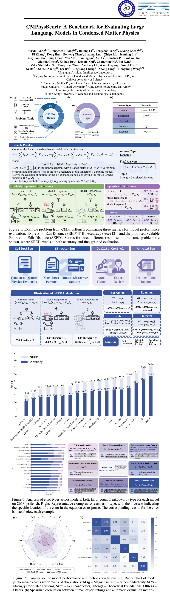

# CMPhysBench: A Benchmark for Evaluating Large Language Models in Condensed Matter Physics

[](https://arxiv.org/abs/2508.18124)&nbsp;&nbsp;&nbsp;[](https://github.com/CMPhysBench/CMPhysBench)&nbsp;&nbsp;&nbsp;[](https://huggingface.co/datasets/weidawang/CMPhysBench)&nbsp;&nbsp;&nbsp;[](https://github.com/CMPhysBench/CMPhysBench/blob/main/LICENSE)


> The dataset is available at [https://huggingface.co/datasets/weidawang/CMPhysBench](https://huggingface.co/datasets/weidawang/CMPhysBench).

CMPhysBench is a benchmark for evaluating large language models in condensed matter physics, featuring 520 graduate-level calculation problems curated from standard textbooks across magnetism, superconductivity, strongly correlated systems, semiconductors, and theoretical foundations. We introduce the Scalable Expression Edit Distance (SEED) metric, which provides fine-grained partial credit for more accurate assessment of reasoning. Experiments show that even state-of-the-art models like Grok-4 achieve less than 30% accuracy, highlighting significant gaps in LLM capabilities for advanced physics reasoning.

<div align="center">
  
</div>

## Acknowledgement
**CMPhysBench** was inspired by previous dataset works including [PHYBench](https://www.phybench.cn/), [PHYSICS](https://arxiv.org/pdf/2506.00022), [GPQA](https://github.com/idavidrein/gpqa) and  [OlympiadBench](https://github.com/OpenBMB/OlympiadBench).

**Scalable Expression Edit Distance (SEED)** is inspired by `Expression Edit Distance (EED)` metric from [PHYBench](https://www.phybench.cn/), which introduced Edit Distance to evaluating symbolic reasoning in physics. We extend and modify this idea by proposing the SEED score, supporting more diverse answer types and providing fine-grained and more robust evaluation dedicated for the fields of Condensed Matter Physics.

We sincerely thank the PHYBench team for their open-source contribution. Their code is released under the [MIT license](https://github.com/phybench-official/phybench?tab=MIT-1-ov-file#readme) and is available at [https://github.com/phybench-official/phybench](https://github.com/phybench-official/phybench).

## Citations

```bibtex
@article{wang2025cmphysbench,
  title={CMPhysBench: A Benchmark for Evaluating Large Language Models in Condensed Matter Physics},
  author={Wang, Weida and Huang, Dongchen and Li, Jiatong and Yang, Tengchao and Zheng, Ziyang and Zhang, Di and Han, Dong and Chen, Benteng and Luo, Binzhao and Liu, Zhiyu and others},
  journal={arXiv preprint arXiv:2508.18124},
  year={2025}
}

@inproceedings{rein2024gpqa,
  title={Gpqa: A graduate-level google-proof q\&a benchmark},
  author={Rein, David and Hou, Betty Li and Stickland, Asa Cooper and Petty, Jackson and Pang, Richard Yuanzhe and Dirani, Julien and Michael, Julian and Bowman, Samuel R},
  booktitle={First Conference on Language Modeling},
  year={2024}
}

@article{zheng2025scaling,
  title={Scaling physical reasoning with the physics dataset},
  author={Zheng, Shenghe and Cheng, Qianjia and Yao, Junchi and Wu, Mengsong and He, Haonan and Ding, Ning and Cheng, Yu and Hu, Shuyue and Bai, Lei and Zhou, Dongzhan and others},
  journal={arXiv preprint arXiv:2506.00022},
  year={2025}
}

@article{he2024olympiadbench,
  title={Olympiadbench: A challenging benchmark for promoting agi with olympiad-level bilingual multimodal scientific problems},
  author={He, Chaoqun and Luo, Renjie and Bai, Yuzhuo and Hu, Shengding and Thai, Zhen Leng and Shen, Junhao and Hu, Jinyi and Han, Xu and Huang, Yujie and Zhang, Yuxiang and others},
  journal={arXiv preprint arXiv:2402.14008},
  year={2024}
}

@article{qiu2025phybench,
  title={Phybench: Holistic evaluation of physical perception and reasoning in large language models},
  author={Qiu, Shi and Guo, Shaoyang and Song, Zhuo-Yang and Sun, Yunbo and Cai, Zeyu and Wei, Jiashen and Luo, Tianyu and Yin, Yixuan and Zhang, Haoxu and Hu, Yi and others},
  journal={arXiv preprint arXiv:2504.16074},
  year={2025}
}
```
